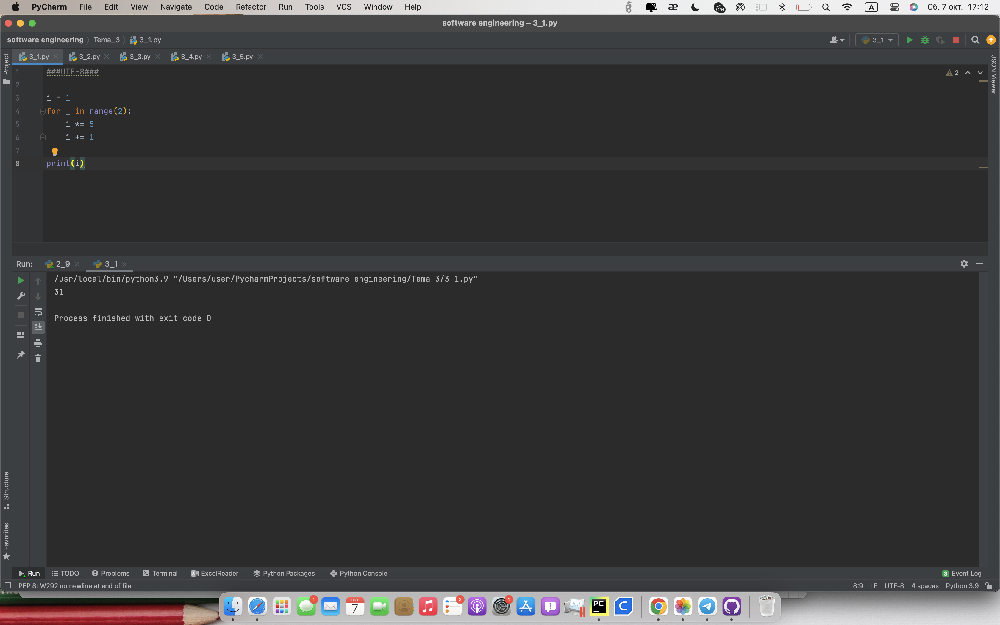
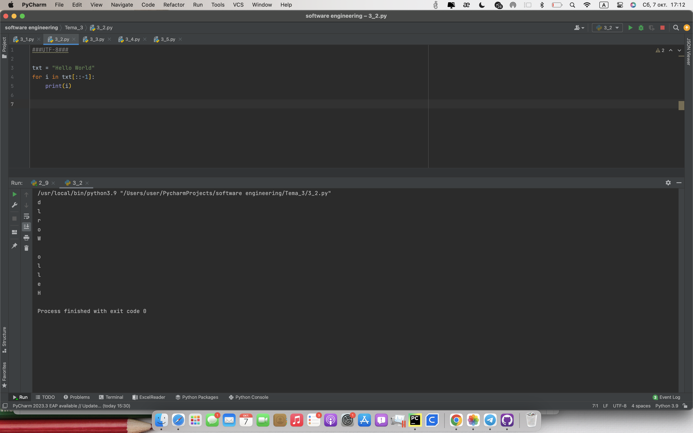
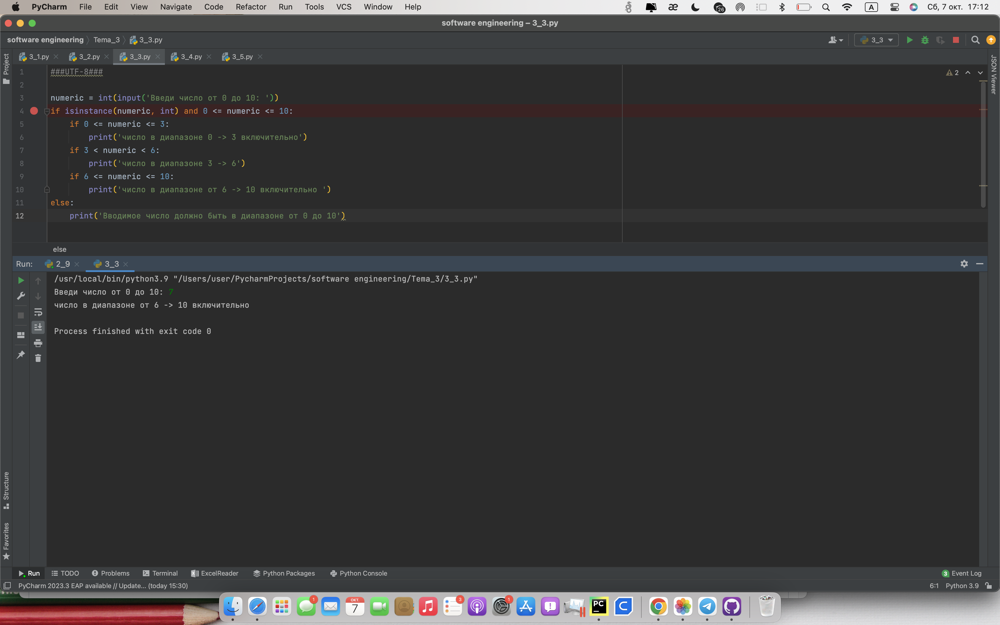
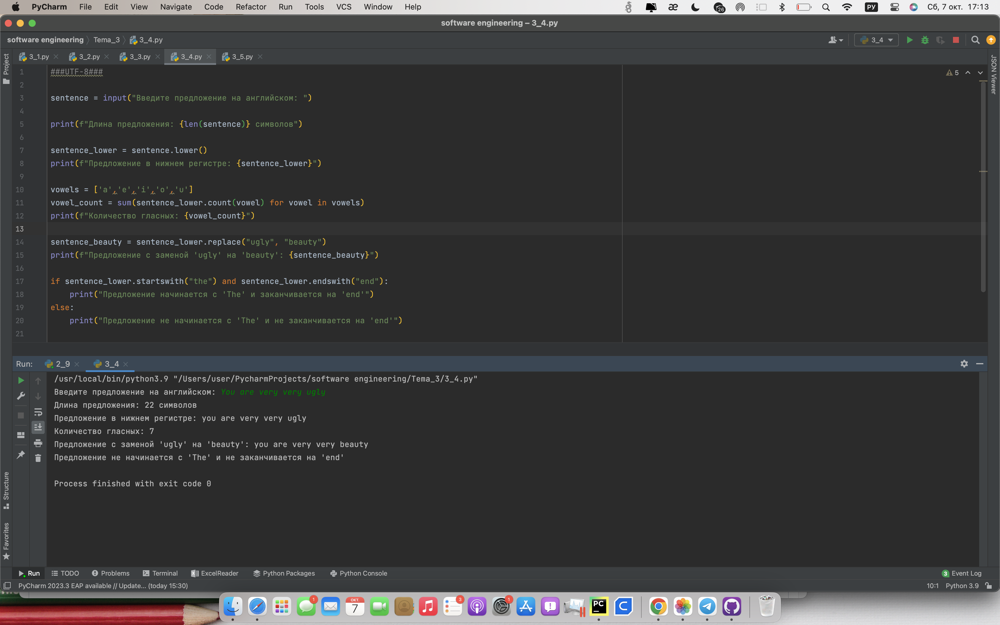
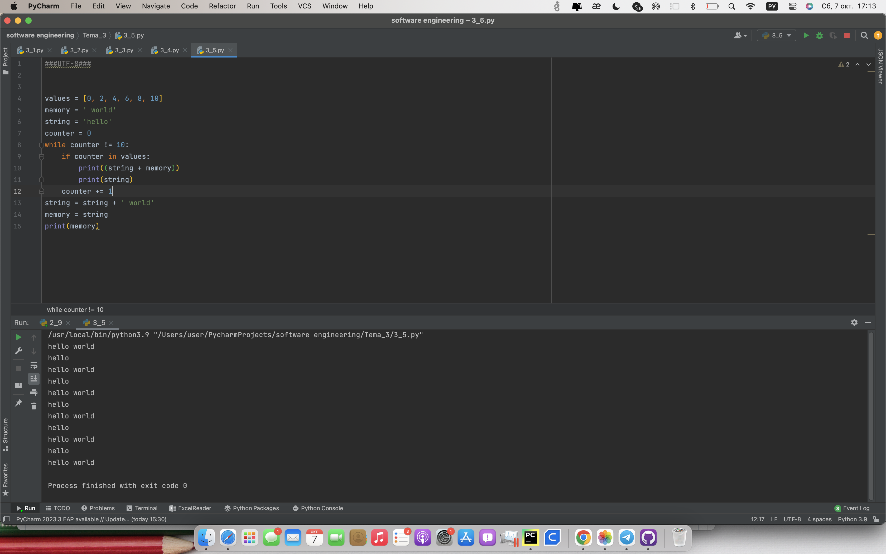

# Тема 3 Операторы, условия, циклы
Отчет по Теме #3 выполнил(а):
- Кондратьева Анастасия Григорьевна
- ЗПИЭ-20-2

 Задание | Сам_раб |
| ------ | ------ |
| Задание 1 | + |
| Задание 2 | + |
| Задание 3 | + |
| Задание 4 | + |
| Задание 5 | + |

знак "+" - задание выполнено; знак "-" - задание не выполнено;

Работу проверили:
- к.э.н., доцент Панов М.А.

## Лабораторная работа №1
### Напишите программу, которая преобразует 1 в 31. Для выполнения поставленной задачи необходимо обязательно и только один раз использовать цикл for, +=1, *=5. Никаких других действий или циклов использовать нельзя.
```python
i = 1
for _ in range(2):
    i *= 5
    i += 1

print(i)
```
### Результат.



## Лабораторная работа №2
### Напишите программу, которая фразу "Hello World" выводит в обратном порядке, и каждая буква находится в одной строке консоли. При этом необходимо обязательно использовать любой цикл, а также программа должна занимать не более 3 строк в редакторе кода.
```python
txt = "Hello World"
for i in txt[::-1]:
    print(i)
```
### Результат.

## Выводы
[::-1] инвертирует массив
      

## Лабораторная работа №3
### Напишите программу, на вход которой поступает значение из консоли, оно должно быть числовым и в диапазоне от 0 до 10 включительно (это необходимо учесть в программе). Если вводимое число не подходит по требованиям, то необходимо вывести оповещение об этом в консоль и остановить программу. Код должен вычислять в каком диапазоне находится полученное число.
```python
numeric = int(input('Введи число от 0 до 10: '))
if isinstance(numeric, int) and 0 <= numeric <= 10:
    if 0 <= numeric <= 3:
        print('число в диапазоне 0 -> 3 включительно')
    if 3 < numeric < 6:
        print('число в диапазоне 3 -> 6')
    if 6 <= numeric <= 10:
        print('число в диапазоне от 6 -> 10 включительно ')
else:
    print('Вводимое число должно быть в диапазоне от 0 до 10') 
```
### Результат.

## Выводы
изучили if      

## Лабораторная работа №4
### Напишите программу на Python, которая принимает предложение (на английском) в качестве входных данных от пользователя и выполняет манипуляции с этим предложением.
```python
sentence = input("Введите предложение на английском: ")

print(f"Длина предложения: {len(sentence)} символов")

sentence_lower = sentence.lower()
print(f"Предложение в нижнем регистре: {sentence_lower}")

vowels = ['a','e','i','o','u']
vowel_count = sum(sentence_lower.count(vowel) for vowel in vowels)
print(f"Количество гласных: {vowel_count}")

sentence_beauty = sentence_lower.replace("ugly", "beauty")
print(f"Предложение с заменой 'ugly' на 'beauty': {sentence_beauty}")

if sentence_lower.startswith("the") and sentence_lower.endswith("end"):
    print("Предложение начинается с 'The' и заканчивается на 'end'")
else:
    print("Предложение не начинается с 'The' и не заканчивается на 'end'")


```
### Результат.
 


## Лабораторная работа №5
### Составьте программу из кусков кода, которая выведет требуемый результат.
```python
values = [0, 2, 4, 6, 8, 10]
memory = ' world'
string = 'hello'
counter = 0
while counter != 10:
    if counter in values:
        print((string + memory))
        print(string)
    counter += 1
string = string + ' world'
memory = string
print(memory)
```
### Результат.

## Выводы
Составляем код из вводных данных

## Общие выводы по теме
изучили слайсинг, if
      
