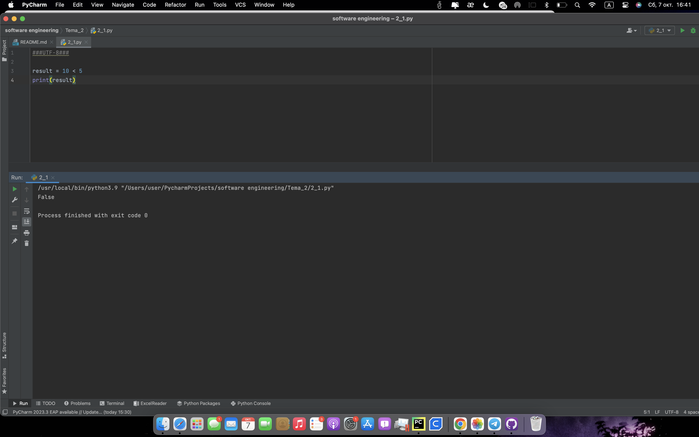
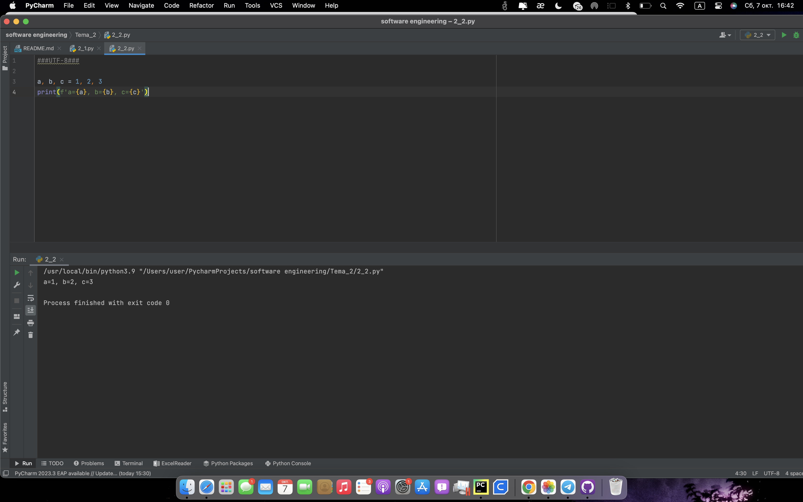
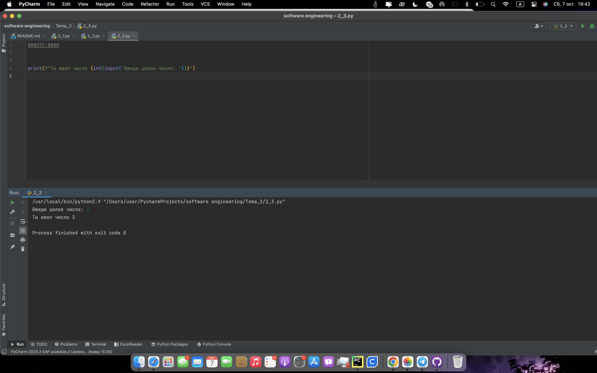
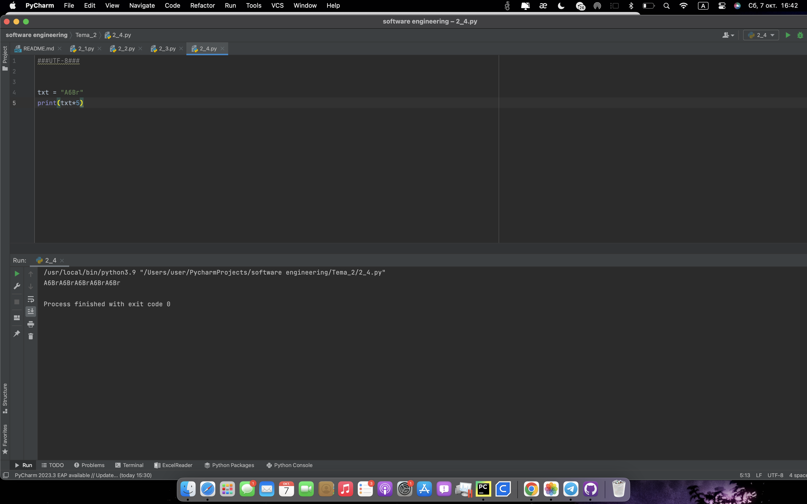
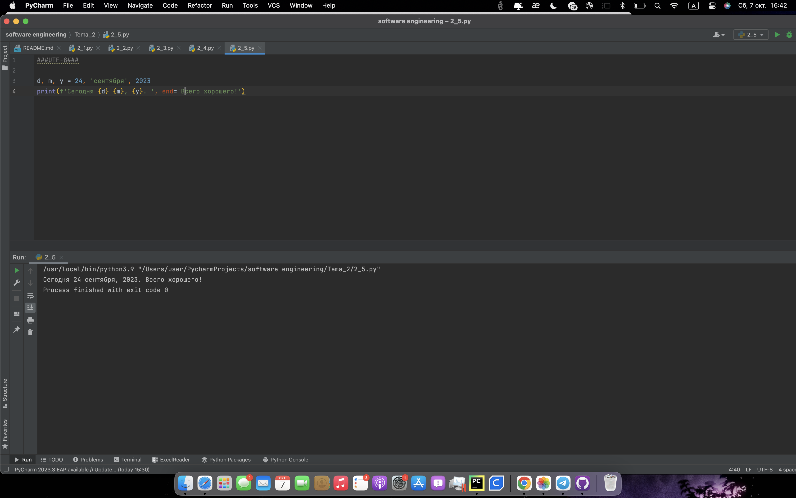
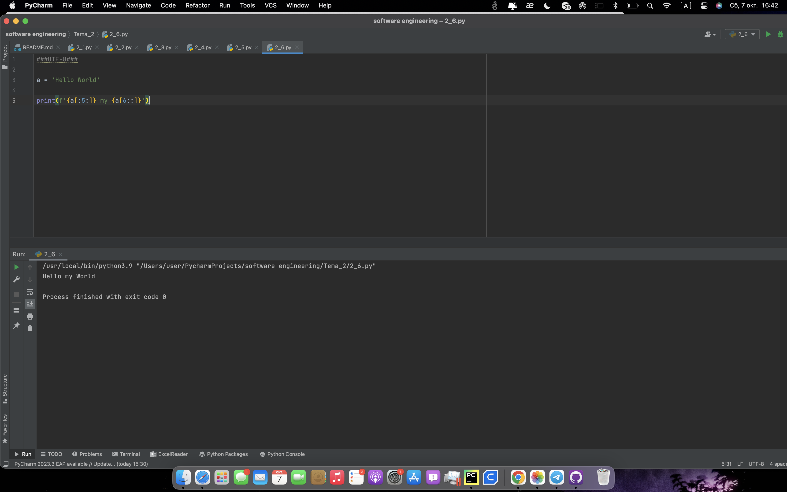
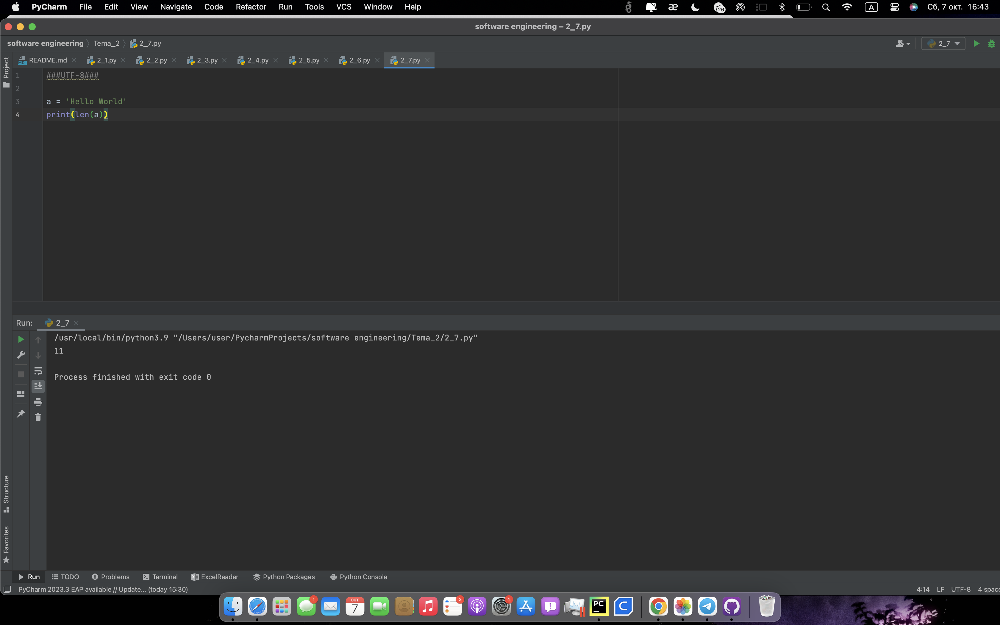
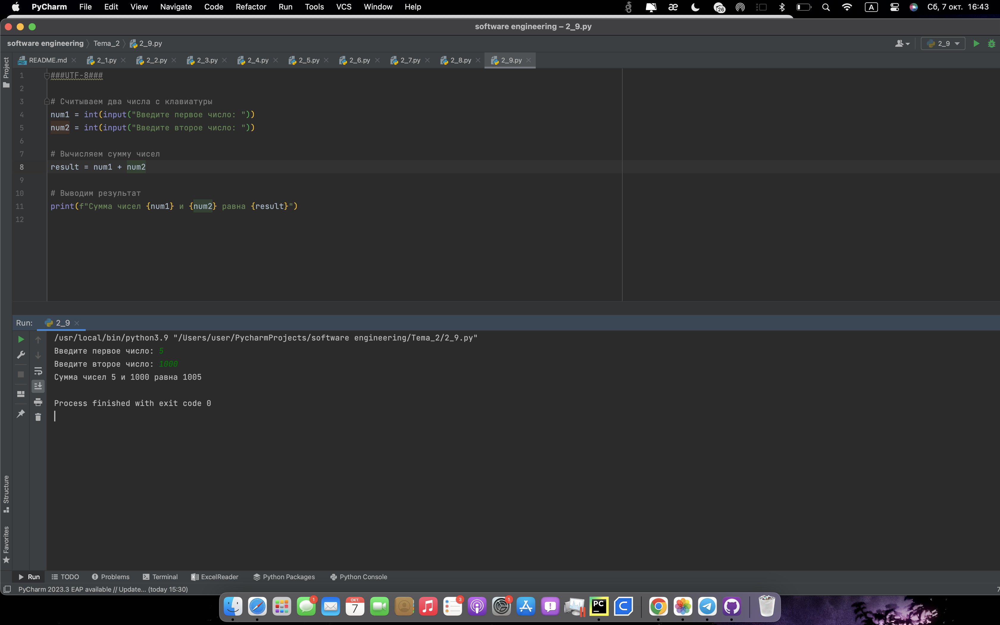
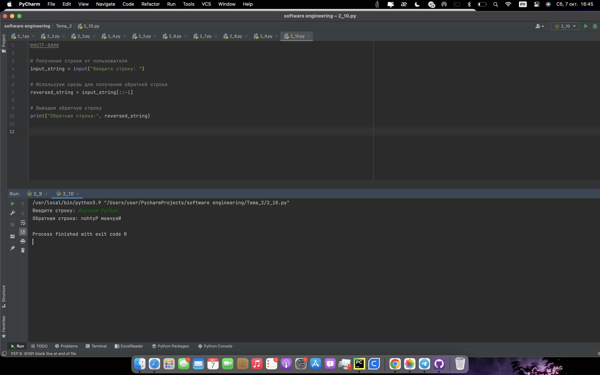

# Тема 2 БАЗОВЫЕ ОПЕРАЦИИ ЯЗЫКА PYTHON
Отчет по Теме #2 выполнил(а):
- Кондратьева Анастасия Григорьевна
- ЗПИЭ-20-2

 Задание | Сам_раб |
| ------ | ------ |
| Задание 1 | + |
| Задание 2 | + |
| Задание 3 | + |
| Задание 4 | + |
| Задание 5 | + |
| Задание 6 | + |
| Задание 7 | + |
| Задание 8 | + |
| Задание 9 | + |
| Задание 10 | + |

знак "+" - задание выполнено; знак "-" - задание не выполнено;

Работу проверили:
- к.э.н., доцент Панов М.А.

## Лабораторная работа №1
### Выведите в консоль булевую переменную False, не используя слово False в строке или изначально присвоенную булевую переменную. Программа должна занимать не более двух строк редактора кода.
```python
result = 10 < 5
print(result)
```
### Результат.

## Выводы
Отрицание любого значения выведет False
      

## Лабораторная работа №2
### Присвоить значения трем переменным и вывести их в консоль, используя только две строки редактора кода.
```python
a, b, c = 1, 2, 3
print(f'а={a}, b={b}, c={c}')
```
### Результат.

## Выводы
Переменные можно задавать списком
      

## Лабораторная работа №3
### Реализуйте ввод данных в программу, через консоль, в виде только целых чисел (тип данных int). То есть при вводе буквенных символов в консоль, программа не должна работать. Программа должна занимать не более двух строк редактора кода.
```python
print(f"Ты ввел число {int(input('Введи целое число: '))}")
```
### Результат.

## Выводы
Программа выкинет ошибку, если не удаётся преобразовать тип данных. В данном задании нет отлавливания ошибки через конструкцию try..catch, но в последующих работах это используется.
      

## Лабораторная работа №4
### Создайте только одну строковую переменную. Длина строки должна не превышать 5 символов. На выходе мы должны получить строку длиной не менее 16 символов. Программа должна занимать не более двух строк редактора кода.
```python
txt = "АбВг"
print(txt*5)
```
### Результат.

## Выводы
Строки можно умножать :)
      

## Лабораторная работа №5
### Создайте три переменные: день (тип данных - числовой), месяц (тип данных - строка), год (тип данных - числовой) и выведите в консоль текущую дату в формате: "Сегодня день месяц год. Всего хорошего!" используя F строку и оператор end внутри print(), в котором вы должны написать фразу "Всего хорошего!". Программа должна занимать не более двух строк редактора кода.
```python
d, m, y = 24, 'сентября', 2023
print(f'Сегодня {d} {m}, {y}. ', end='Всего хорошего!')
```
### Результат.

## Выводы
Изучили f-строки
      

## Лабораторная работа №6
### В предложении "Hello World" вставьте "my" между двумя словами. Выведите полученное предложение в консоль в одну строку. Программа должна занимать не более двух строк редактора кода.
```python
a = 'Hello World'

print(f'{a[:5:]} my {a[6::]}')
```
### Результат.

## Выводы
метод replace позволяет заменять часть строки
      

## Лабораторная работа №7
### Узнайте длину предложения "Hello World", результат выведите в консоль. Программа должна занимать не более двух строк редактора кода.
```python
a = 'Hello World'
print(len(a))
```
### Результат.

## Выводы
len возвращает длину строки
      

## Лабораторная работа №8
### Переведите предложение "HELLO WORLD" в нижний регистр. Программа должна занимать не более двух строк редактора кода.
```python
a = 'HELLO WORLD'
print(a.lower())
```
### Результат.

## Выводы
метод lower приводит строку к нижнему регистру
      

## Лабораторная работа №9
### Сложить 2 числа от пользователя
```python
# Считываем два числа с клавиатуры
num1 = int(input("Введите первое число: "))
num2 = int(input("Введите второе число: "))

# Вычисляем сумму чисел
result = num1 + num2

# Выводим результат
print(f"Сумма чисел {num1} и {num2} равна {result}")
```
### Результат.

## Выводы
Складываем 2 значения input
      

## Лабораторная работа №10
### Развернуть строку введенную пользователем
```python
# Получение строки от пользователя
input_string = input("Введите строку: ")

# Используем срезы для получения обратной строки
reversed_string = input_string[::-1]

# Выводим обратную строку
print("Обратная строка:", reversed_string)
```
### Результат.

## Выводы
Разворачиваем введенную строку
      


## Общие выводы по теме
Изучили строки, числа, переменные, булевые значения