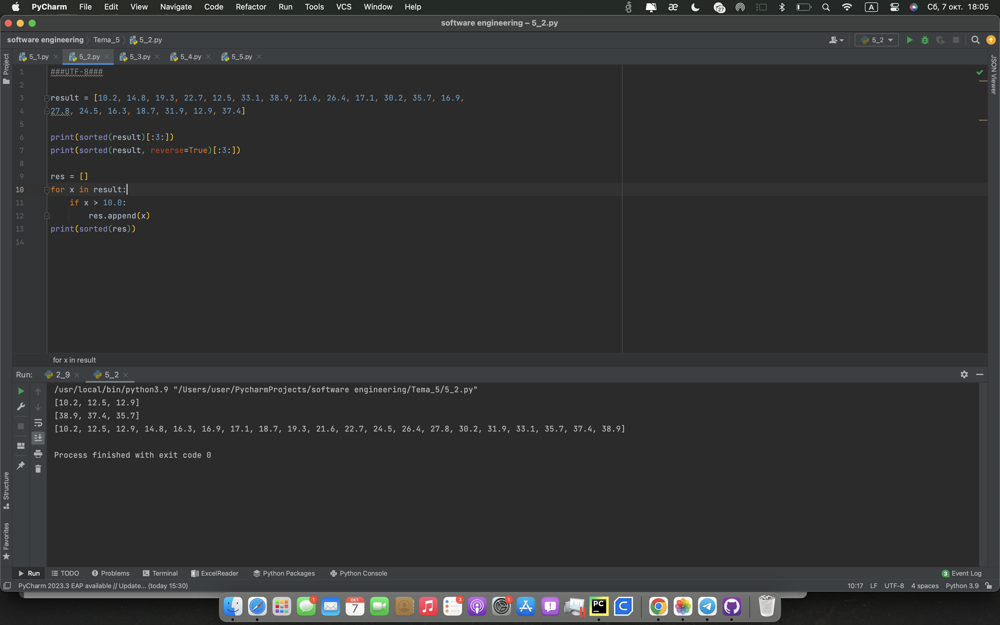
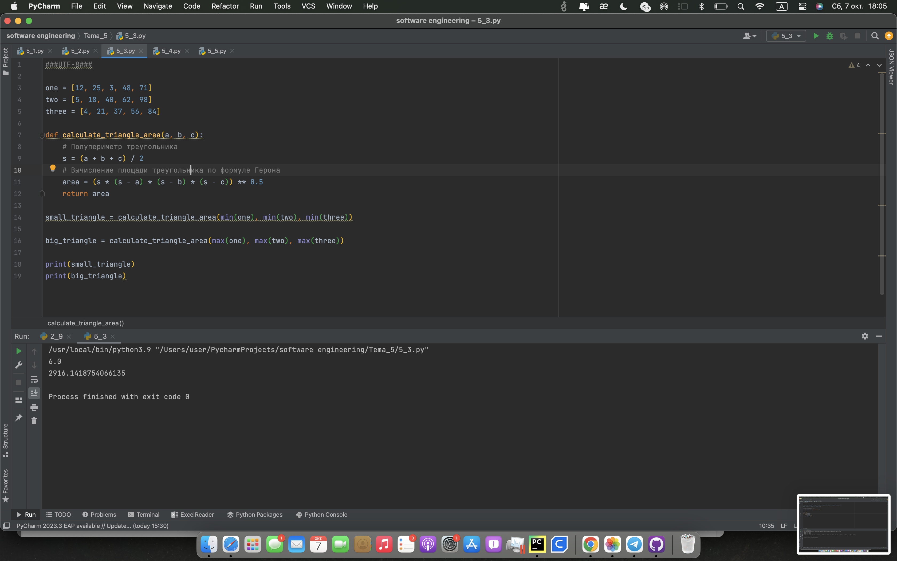
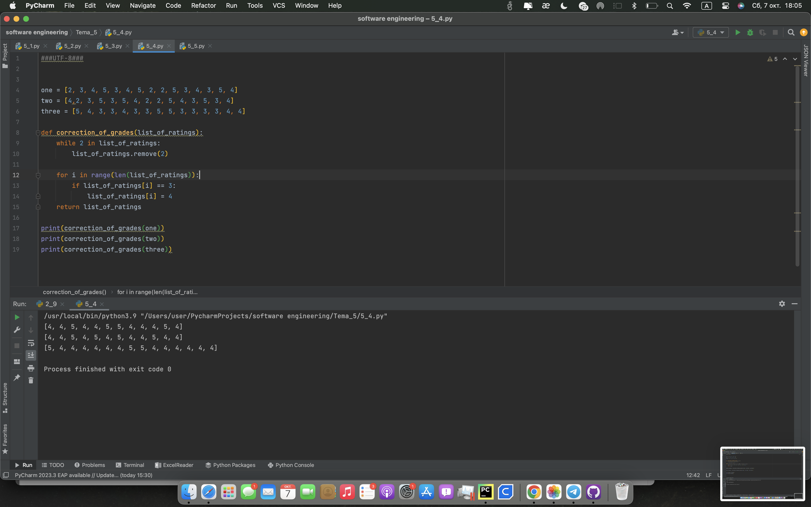
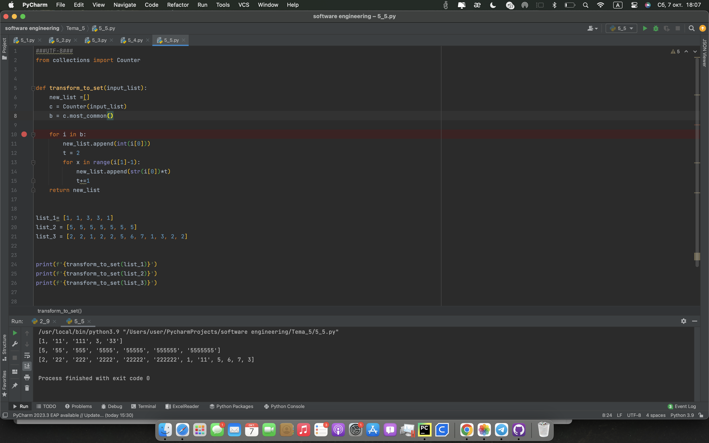

# Тема 5 Базовые коллекции: множества, списки
Отчет по Теме #5 выполнил(а):
- Кондратьева Анастасия Григорьеввна
- ЗПИЭ-20-2

 Задание | Сам_раб |
| ------ | ------ |
| Задание 1 | + |
| Задание 2 | + |
| Задание 3 | + |
| Задание 4 | + |
| Задание 5 | + |

знак "+" - задание выполнено; знак "-" - задание не выполнено;

Работу проверили:
- к.э.н., доцент Панов М.А.

## Лабораторная работа №1
### Ресторан на предприятии ведет учет посещений за неделю при помощи кода работника. У них есть список со всеми посещениями за неделю. Вычислить: - Сколько было выдано чеков; - Сколько разных людей посетило ресторан; - Какой работник посетил ресторан больше всех раз
```python
from collections import Counter

visitor =[8734, 2345, 8201, 6621, 9999, 1234, 5678, 8201, 8888, 4321, 3365,
1478, 9865, 5555, 7777, 9998, 1111, 2222, 3333, 4444, 5556, 6666,
5410, 7778, 8889, 4445, 1439, 9604, 8201, 3365, 7502, 3016, 4928,
5837, 8201, 2643, 5017, 9682, 8530, 3250, 7193, 9051, 4506, 1987,
3365, 5410, 7168, 7777, 9865, 5678, 8201, 4445, 3016, 4506, 4506]


print(f'Всего выдано чеков: {len(visitor)}')
print(f'Унмкальных посетителей {len(set(visitor))}')
c = Counter(visitor)
b = c.most_common(1)[0]
print(f'Посетитель {b[0]} был в ресторане больше всех. Всего {b[1]} раз')

```
### Результат.

## Выводы
Научились сортировать массивы, искать повторения.
      

## Лабораторная работа №2
### На физкультуре студенты сдавали бег, у преподавателя физкультуры есть список всех результатов, ему нужно узнать: -Три лучшие результата; -Три худшие результата; -Все результаты начиная с 10. Ваша задача помочь ему в этом.
```python
result = [10.2, 14.8, 19.3, 22.7, 12.5, 33.1, 38.9, 21.6, 26.4, 17.1, 30.2, 35.7, 16.9,
27.8, 24.5, 16.3, 18.7, 31.9, 12.9, 37.4]

print(sorted(result)[:3:])
print(sorted(result, reverse=True)[:3:])

res = []
for x in result:
    if x > 10.0:
        res.append(x)
print(sorted(res))
```
### Результат.

## Выводы
Научились сортировать данные
      

## Лабораторная работа №3
### Преподаватель по математике придумал странную задачку. У вас есть три списка с элементами, каждый элемент которых – длина стороны треугольника, ваша задача найти площади двух треугольников, составленные из максимальных и минимальных элементов полученных списков.
```python
one = [12, 25, 3, 48, 71]
two = [5, 18, 40, 62, 98]
three = [4, 21, 37, 56, 84]

def calculate_triangle_area(a, b, c):
    # Полупериметр треугольника
    s = (a + b + c) / 2
    # Вычисление площади треугольника по формуле Герона
    area = (s * (s - a) * (s - b) * (s - c)) ** 0.5
    return area

small_triangle = calculate_triangle_area(min(one), min(two), min(three))

big_triangle = calculate_triangle_area(max(one), max(two), max(three))

print(small_triangle)
print(big_triangle)
```
### Результат.


      

## Лабораторная работа №4
### Никто не любит получать плохие оценки, поэтому Борис решил это исправить. Допустим, что все оценки студента за семестр хранятся в одном списке. Ваша задача удалить из этого списка все двойки, а все тройки заменить на четверки.
```python
one = [2, 3, 4, 5, 3, 4, 5, 2, 2, 5, 3, 4, 3, 5, 4]
two = [4,2, 3, 5, 3, 5, 4, 2, 2, 5, 4, 3, 5, 3, 4]
three = [5, 4, 3, 3, 4, 3, 3, 5, 5, 3, 3, 3, 3, 4, 4]

def correction_of_grades(list_of_ratings):
    while 2 in list_of_ratings:
        list_of_ratings.remove(2)

    for i in range(len(list_of_ratings)):
        if list_of_ratings[i] == 3:
            list_of_ratings[i] = 4
    return list_of_ratings

print(correction_of_grades(one))
print(correction_of_grades(two))
print(correction_of_grades(three))
```
### Результат.

## Выводы
Научились заменять данные в массиве
      

## Лабораторная работа №5
### Вам предоставлены списки натуральных чисел, из них необходимо сформировать множества. При этом следует соблюдать это правило: если какое-либо число повторяется, то преобразовать его в строку по следующему образцу: например, если число 4 повторяется 3 раза, то в множестве будет следующая запись: само число 4, строка «44», строка «444».
```python
from collections import Counter


def transform_to_set(input_list):
    new_list =[]
    c = Counter(input_list)
    b = c.most_common()

    for i in b:
        new_list.append(int(i[0]))
        t = 2
        for x in range(i[1]-1):
            new_list.append(str(i[0])*t)
            t+=1
    return new_list


list_1= [1, 1, 3, 3, 1]
list_2 = [5, 5, 5, 5, 5, 5, 5]
list_3 = [2, 2, 1, 2, 2, 5, 6, 7, 1, 3, 2, 2]


print(f'{transform_to_set(list_1)}')
print(f'{transform_to_set(list_2)}')
print(f'{transform_to_set(list_3)}')
```
### Результат.

## Выводы
Научились формировать множества
      


## Общие выводы по теме
Научились работать с коллекциями, множествами
      