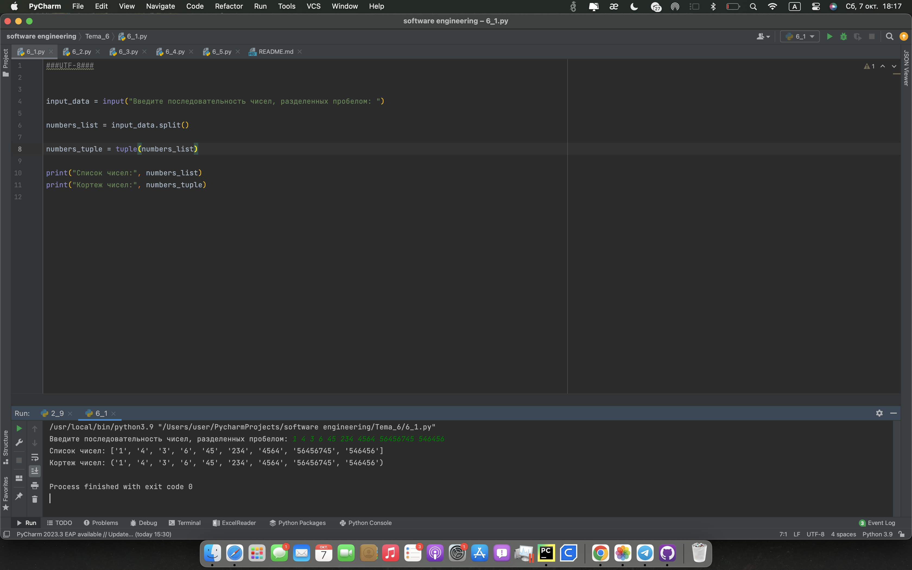
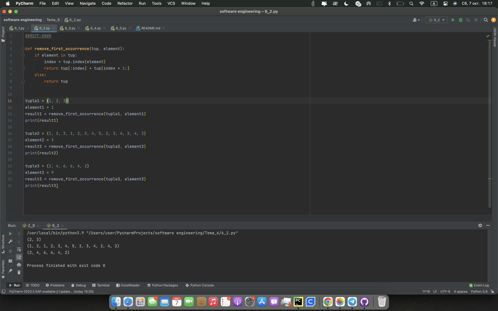
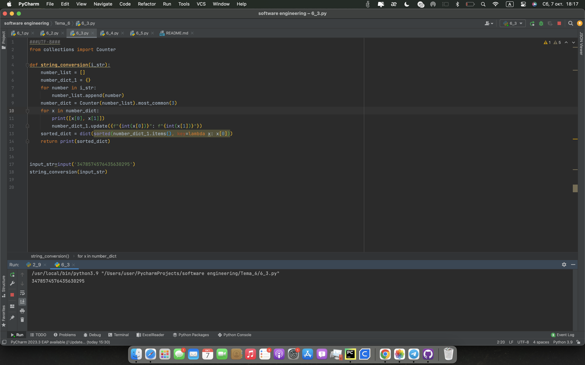
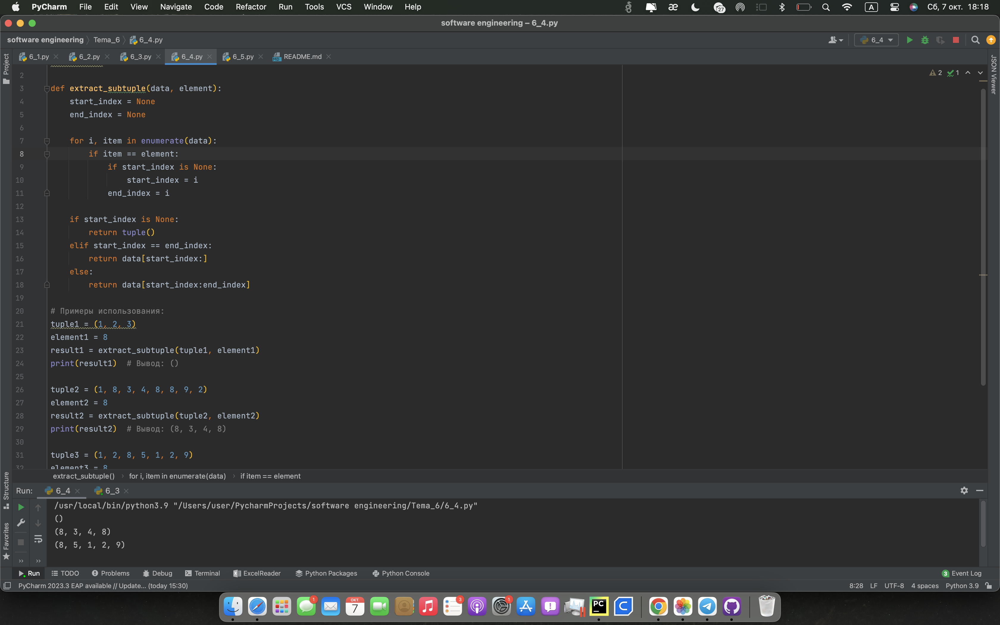
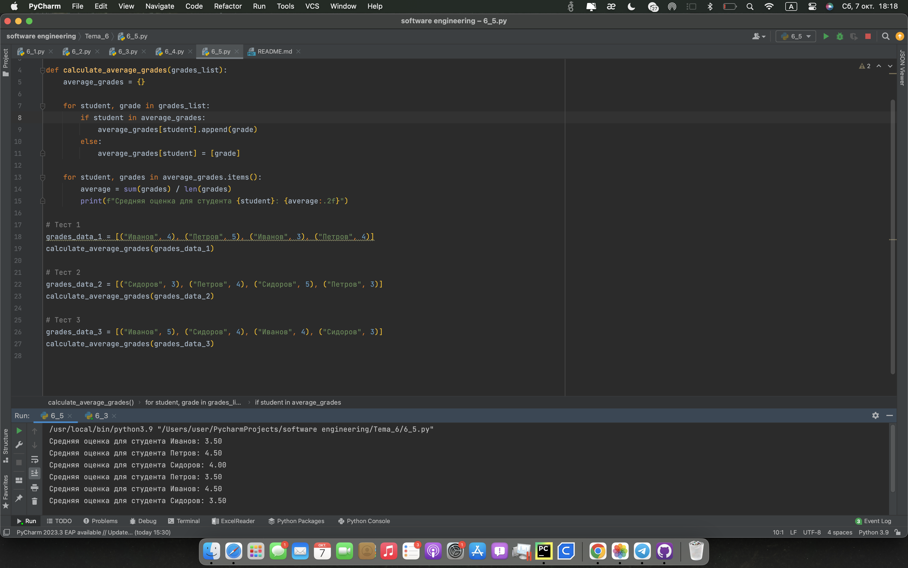

# Тема 6 Базовые коллекции: словари, кортежи
Отчет по Теме #6 выполнил(а):
- Кондратьева Анастасия Григорьевна
- ЗПИЭ-20-2

 Задание | Сам_раб |
| ------ | ------ |
| Задание 1 | + |
| Задание 2 | + |
| Задание 3 | + |
| Задание 4 | + |
| Задание 5 | + |

знак "+" - задание выполнено; знак "-" - задание не выполнено;

Работу проверили:
- к.э.н., доцент Панов М.А.

## Лабораторная работа №1
### При создании сайта у вас возникла потребность обрабатывать данные пользователя в странной форме, а потом переводить их в нужные вам форматы. Вы хотите принимать от пользователя последовательность чисел, разделенных пробелом, а после переформатировать эти данные в список и кортеж. Реализуйте вашу задумку. Для получения начальных данных используйте input(). Результатом программы будет выведенный список и кортеж из начальных данных.
```python
input_data = input("Введите последовательность чисел, разделенных пробелом: ")

numbers_list = input_data.split()

numbers_tuple = tuple(numbers_list)

print("Список чисел:", numbers_list)
print("Кортеж чисел:", numbers_tuple)

```
### Результат.

## Выводы
Научились создавать список и кортеж
      

## Лабораторная работа №2
### Николай знает, что кортежи являются неизменяемыми, но он очень упрямый и всегда хочет доказать, что он прав. Студент решил создать функцию, которая будет удалять первое появление определенного элемента из кортежа по значению и возвращать кортеж без него. Попробуйте повторить шедевр не признающего авторитеты начинающего программиста. Но учтите, что Николай не всегда уверен в наличии элемента в кортеже (в этом случае кортеж вернется функцией в исходном виде).
```python
def remove_first_occurrence(tup, element):
    if element in tup:
        index = tup.index(element)
        return tup[:index] + tup[index + 1:]
    else:
        return tup

tuple1 = (1, 2, 3)
element1 = 1
result1 = remove_first_occurrence(tuple1, element1)
print(result1)

tuple2 = (1, 2, 3, 1, 2, 3, 4, 5, 2, 3, 4, 2, 4, 2)
element2 = 3
result2 = remove_first_occurrence(tuple2, element2)
print(result2)

tuple3 = (2, 4, 6, 6, 4, 2)
element3 = 9
result3 = remove_first_occurrence(tuple3, element3)
print(result3)
```
### Результат.

## Выводы
Научились преобразовывать кортежи
      

## Лабораторная работа №3
### Ребята поспорили кто из них одним нажатием на numpad наберет больше повторяющихся цифр, но не понимают, как узнать победителя. Вам им нужно в этом помочь. Дана строка в виде случайной последовательности чисел от 0 до 9 (длина строки минимум 15 символов). Требуется создать словарь, который в качестве ключей будет принимать данные числа (т. е. ключи будут типом int), а в качестве значений – количество этих чисел в имеющейся последовательности. Для построения словаря создайте  функцию, принимающую строку из цифр. Функция должна возвратить словарь из 3-х самых часто встречаемых чисел, также эти значения нужно вывести в порядке возрастания ключа.
```python
from collections import Counter

def string_conversion(i_str):
    number_list = []
    number_dict_1 = {}
    for number in i_str:
        number_list.append(number)
    number_dict = Counter(number_list).most_common(3)
    for x in number_dict:
        print([x[0], x[1]])
        number_dict_1.update({f"{int(x[0])}": f"{int(x[1])}"})
    sorted_dict = dict(sorted(number_dict_1.items(), key=lambda x: x[0]))
    return print(sorted_dict)


input_str=input('3478574576435630295')
string_conversion(input_str)
```
### Результат.



## Лабораторная работа №4
### Ваш хороший друг владеет офисом со входом по электронным картам, ему нужно чтобы вы написали программу, которая показывала в каком порядке сотрудники входили и выходили из офиса. Определение сотрудника происходит по id. Напишите функцию, которая на вход принимает кортеж и случайный элемент (id), его можно придумать самостоятельно. Требуется вернуть новый кортеж, начинающийся с первого появления элемента в нем и заканчивающийся вторым его появлением включительно. Если элемента нет вовсе – вернуть пустой кортеж. Если элемент встречается только один раз, то вернуть кортеж, который начинается с него и идет до конца исходного.
```python
def extract_subtuple(data, element):
    start_index = None
    end_index = None

    for i, item in enumerate(data):
        if item == element:
            if start_index is None:
                start_index = i
            end_index = i

    if start_index is None:
        return tuple()
    elif start_index == end_index:
        return data[start_index:]
    else:
        return data[start_index:end_index]
```
### Результат.

## Выводы
Научились определять индексы вхождений
      

## Лабораторная работа №5
### Функция по вычислению среднеарифметической оценки студентов
```python
def calculate_average_grades(grades_list):
    average_grades = {}

    for student, grade in grades_list:
        if student in average_grades:
            average_grades[student].append(grade)
        else:
            average_grades[student] = [grade]

    for student, grades in average_grades.items():
        average = sum(grades) / len(grades)
        print(f"Средняя оценка для студента {student}: {average:.2f}")

# Тест 1
grades_data_1 = [("Иванов", 4), ("Петров", 5), ("Иванов", 3), ("Петров", 4)]
calculate_average_grades(grades_data_1)

# Тест 2
grades_data_2 = [("Сидоров", 3), ("Петров", 4), ("Сидоров", 5), ("Петров", 3)]
calculate_average_grades(grades_data_2)

# Тест 3
grades_data_3 = [("Иванов", 5), ("Сидоров", 4), ("Иванов", 4), ("Сидоров", 3)]
calculate_average_grades(grades_data_3)
```
### Результат.

      


## Общие выводы по теме
Научились работать со словарями, кортежами
      
