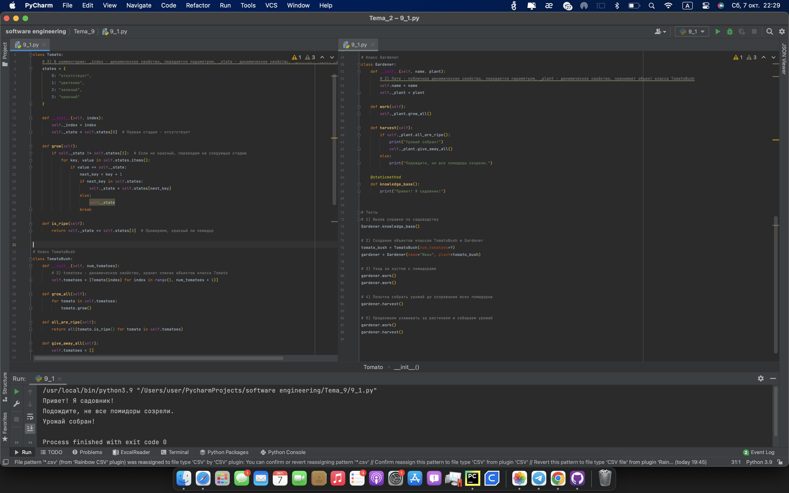

# Тема 9 Концепции и принципы ООП
Отчет по Теме #9 выполнил(а):
-  Кондратьева Анастасия Григорьевна
- ЗПИЭ-20-2

 Задание | Сам_раб |
| ------ | ------ |
| Задание 1 | + |

знак "+" - задание выполнено; знак "-" - задание не выполнено;

Работу проверили:
- к.э.н., доцент Панов М.А.

## Лабораторная работа №1
### Задание Садовник и помидоры.
```python
# Класс Tomato
class Tomato:
    # 3) В комментарии: _index - динамическое свойство, передается параметром, _state - динамическое свойство, принимает первое значение из словаря states
    states = {
        0: "отсутствует",
        1: "цветение",
        2: "зеленый",
        3: "красный"
    }

    def __init__(self, index):
        self._index = index
        self._state = self.states[0]  # Первая стадия - отсутствует

    def grow(self):
        if self._state != self.states[3]:  # Если не красный, переводим на следующую стадию
            for key, value in self.states.items():
                if value == self._state:
                    next_key = key + 1
                    if next_key in self.states:
                        self._state = self.states[next_key]
                    else:
                        self._state
                    break

    def is_ripe(self):
        return self._state == self.states[3]  # Проверяем, красный ли помидор


# Класс TomatoBush
class TomatoBush:
    def __init__(self, num_tomatoes):
        # 2) tomatoes - динамическое свойство, хранит список объектов класса Tomato
        self.tomatoes = [Tomato(index) for index in range(1, num_tomatoes + 1)]

    def grow_all(self):
        for tomato in self.tomatoes:
            tomato.grow()

    def all_are_ripe(self):
        return all(tomato.is_ripe() for tomato in self.tomatoes)

    def give_away_all(self):
        self.tomatoes = []


# Класс Gardener
class Gardener:
    def __init__(self, name, plant):
        # 2) Пате - публичное динамическое свойство, передается параметром, _plant - динамическое свойство, принимает объект класса TomatoBush
        self.name = name
        self._plant = plant

    def work(self):
        self._plant.grow_all()

    def harvest(self):
        if self._plant.all_are_ripe():
            print("Урожай собран!")
            self._plant.give_away_all()
        else:
            print("Подождите, не все помидоры созрели.")

    @staticmethod
    def knowledge_base():
        print("Привет! Я садовник!")


# Тесты
# 1) Вызов справки по садоводству
Gardener.knowledge_base()

# 2) Создание объектов классов TomatoBush и Gardener
tomato_bush = TomatoBush(num_tomatoes=9)
gardener = Gardener(name="Иван", plant=tomato_bush)

# 3) Уход за кустом с помидорами
gardener.work()
gardener.work()

# 4) Попытка собрать урожай до созревания всех помидоров
gardener.harvest()

# 5) Продолжаем ухаживать за растением и собираем урожай
gardener.work()
gardener.harvest()
```
### Результат.

## Выводы
Ухаживаем за садом, собираем помидоры
