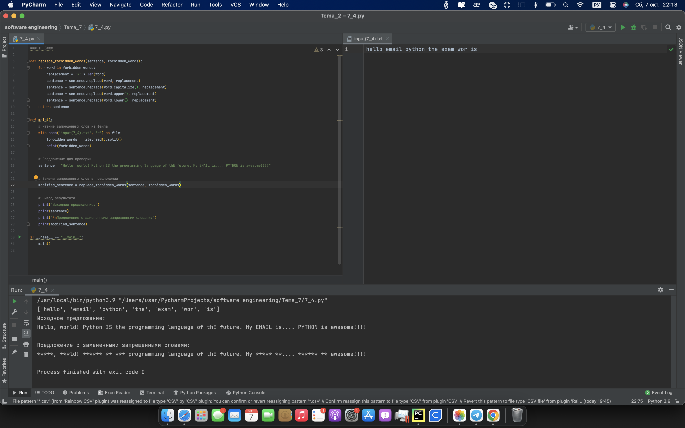
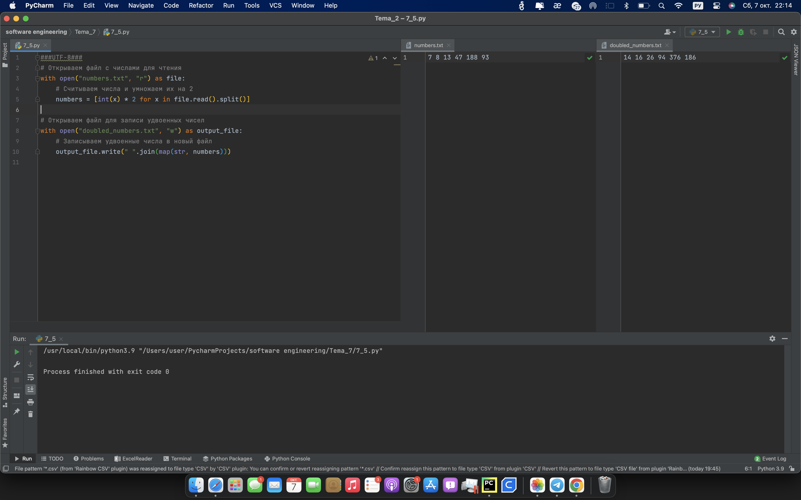

# Тема 7 Работа с файлами (ввод, вывод)
Отчет по Теме #7 выполнил(а):
- Кондратьева Анастасия Григорьевна
- ЗПИЭ-20-2

 Задание | Сам_раб |
| ------ | ------ |
| Задание 1 | + |
| Задание 2 | + |
| Задание 3 | + |
| Задание 4 | + |
| Задание 5 | + |

знак "+" - задание выполнено; знак "-" - задание не выполнено;

Работу проверили:
- к.э.н., доцент Панов М.А.

## Лабораторная работа №1
### Найдите в интернете любую статью (объем статьи не менее 200 слов), скопируйте ее содержимое в файл и напишите программу, которая считает количество слов в текстовом файле и определит самое часто встречающееся слово. Результатом выполнения задачи будет: скриншот файла со статьей, листинг кода, и вывод в консоль, в котором будет указана вся необходимая информация.
```python
import re
from collections import Counter

def count_words(file_path):
    with open(file_path, 'r', encoding='utf-8') as file:
        text = file.read().lower()  # Чтение файла и приведение к нижнему регистру

        # Используем регулярное выражение для извлечения слов из текста
        words = re.findall(r'\b\w+\b', text)
        print(words)

        # Подсчет частоты встречаемости слов
        word_counts = Counter(words)

        # Находим самое часто встречающееся слово
        most_common_word, count = word_counts.most_common(1)[0]

        # Вывод результата
        print(f"Количество слов в файле: {len(words)}")
        print(f"Самое часто встречающееся слово: '{most_common_word}' (встречается {count} раз)")

# Укажи путь к своему текстовому файлу
file_path = 'text.txt'
count_words(file_path)
```
### Результат.

### Выводы.
познакомились с регулярными выражениями


## Лабораторная работа №2
### У вас появилась потребность в ведении книги расходов, посмотрев все существующие варианты вы пришли к выводу что вас ничего не устраивает и нужно все делать самому. Напишите программу для учета расходов. Программа должна позволять вводить информацию о расходах, сохранять ее в файл и выводить существующие данные в консоль. Ввод информации происходит через консоль. Результатом выполнения задачи будет: скриншот файла с учетом расходов, листинг кода, и вывод в консоль, с демонстрацией работоспособности программы.
```python
import json
import os

def load_expenses():
    if os.path.exists('expenses.json'):
        with open('expenses.json', 'r') as file:
            return json.load(file)
    else:
        return []

def save_expenses(expenses):
    with open('expenses.json', 'w') as file:
        json.dump(expenses, file)

def add_expense():
    name = input("Введите название расхода: ")
    amount = float(input("Введите сумму: "))

    return {"name": name, "amount": amount}

def display_expenses(expenses):
    for expense in expenses:
        print(f"{expense['name']}: {expense['amount']}")

def main():
    expenses = load_expenses()

    while True:
        print("\n1. Ввести новый расход")
        print("2. Показать все расходы")
        print("3. Выход")

        choice = input("Выберите действие (1/2/3): ")

        if choice == '1':
            new_expense = add_expense()
            expenses.append(new_expense)
            save_expenses(expenses)
        elif choice == '2':
            display_expenses(expenses)
        elif choice == '3':
            break
        else:
            print("Некорректный выбор. Пожалуйста, выберите 1, 2 или 3.")

if __name__ == "__main__":
    main()
```
### Результат.

## Выводы
Использовали формат JSON
      

## Лабораторная работа №3
### Имеется файл input.txt с текстом на латинице. Напишите программу, которая выводит следующую статистику по тексту: количество букв латинского алфавита; число слов; число строк.
```python
def analyze_text(file_path):
    # Инициализируем счетчики
    letter_count = 0
    word_count = 0
    line_count = 0

    # Открываем файл и читаем его построчно
    with open(file_path, 'r') as file:
        for line in file:
            # Увеличиваем счетчик строк
            line_count += 1
            # Увеличиваем счетчик букв на количество букв в текущей строке
            letter_count += len([char for char in line if char.isalpha()])
            # Увеличиваем счетчик слов на количество слов в текущей строке
            word_count += len(line.split())

    # Выводим результат
    print(f'Input file contains:')
    print(f'{letter_count} letters')
    print(f'{word_count} words')
    print(f'{line_count} lines')

# Вызываем функцию с указанием пути к файлу
analyze_text('input(7_3).txt')
```
### Результат.

## Выводы
Воспользовались строковыми циклами
      

## Лабораторная работа №4
### Напишите программу, которая получает на вход предложение, выводит его в терминал, заменяя все запрещенные слова звездочками * (количество звездочек равно количеству букв в слове). Запрещенные слова, разделенные символом пробела, хранятся в текстовом файле input.txt. Все слова в этом файле записаны в нижнем регистре. Программа должна заменить запрещенные слова, где бы они ни встречались, даже в середине другого слова. Замена производится независимо от регистра: если файл input.txt содержит запрещенное слово exam, то слова exam, Exam, ExaM, EXAM и exAm должны быть заменены на ****.
```python
def replace_forbidden_words(sentence, forbidden_words):
    for word in forbidden_words:
        replacement = '*' * len(word)
        sentence = sentence.replace(word, replacement)
        sentence = sentence.replace(word.capitalize(), replacement)
        sentence = sentence.replace(word.upper(), replacement)
        sentence = sentence.replace(word.lower(), replacement)
    return sentence

def main():
    # Чтение запрещенных слов из файла
    with open('input(7_4).txt', 'r') as file:
        forbidden_words = file.read().split()
        print(forbidden_words)

    # Предложение для проверки
    sentence = "Hello, world! Python IS the programming language of thE future. My EMAIL is.... PYTHON is awesome!!!!"

    # Замена запрещенных слов в предложении
    modified_sentence = replace_forbidden_words(sentence, forbidden_words)

    # Вывод результата
    print("Исходное предложение:")
    print(sentence)
    print("\nПредложение с замененными запрещенными словами:")
    print(modified_sentence)

if __name__ == "__main__":
    main()
```
### Результат.

## Выводы
Научились заменять символы
      

## Лабораторная работа №5
### Принять строку чисел из файла и создать новый файл с числами умноженными на 2
```python
with open("numbers.txt", "r") as file:
    # Считываем числа и умножаем их на 2
    numbers = [int(x) * 2 for x in file.read().split()]

# Открываем файл для записи удвоенных чисел
with open("doubled_numbers.txt", "w") as output_file:
    # Записываем удвоенные числа в новый файл
    output_file.write(" ".join(map(str, numbers)))
```
### Результат.

## Выводы
Получаем, читаем, записываем информацию
      


## Общие выводы по теме
Научилились работать с файлами
