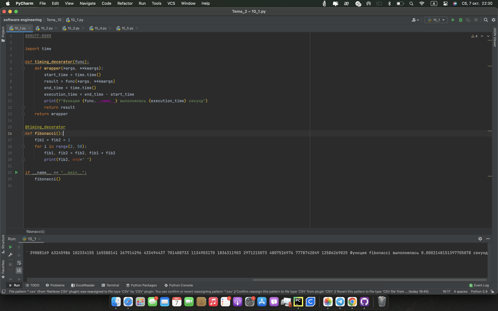
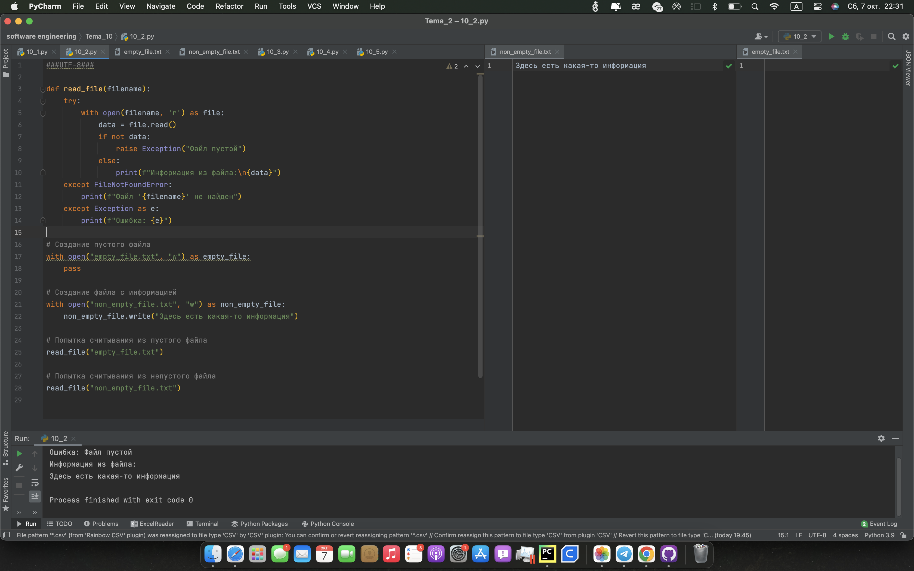
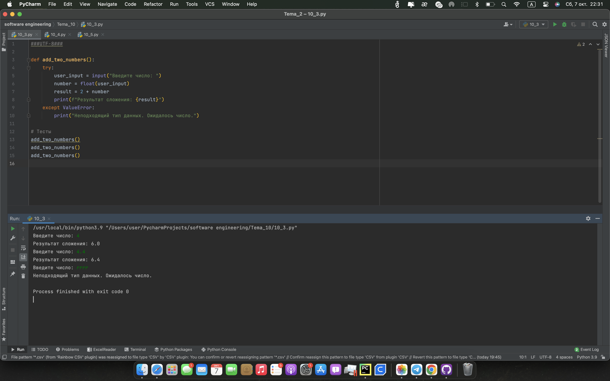
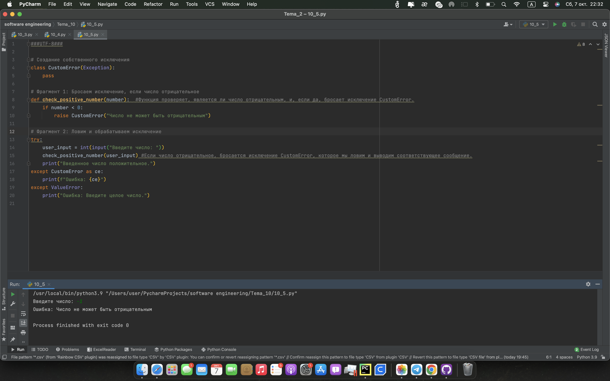

# Тема 10 Декораторы и исключения
Отчет по Теме #10 выполнил(а):
- Ягнышев Владислав Павлович
- ЗПИЭ-20-2

 Задание | Сам_раб |
| ------ | ------ |
| Задание 1 | + |
| Задание 2 | + |
| Задание 3 | + |
| Задание 4 | + |
| Задание 5 | + |

знак "+" - задание выполнено; знак "-" - задание не выполнено;

Работу проверили:
- к.э.н., доцент Панов М.А.

## Лабораторная работа №1
### Вовочка решил заняться спортивным программированием на python, но для этого он должен знать за какое время выполняется его программа. Он решил, что для этого ему идеально подойдет декоратор для функции, который будет выяснять за какое время выполняется та или иная функция. Помогите Вовочке в его начинаниях и напишите такой декоратор.
```python
import time

def timing_decorator(func):
    def wrapper(*args, **kwargs):
        start_time = time.time()
        result = func(*args, **kwargs)
        end_time = time.time()
        execution_time = end_time - start_time
        print(f"Функция {func.__name__} выполнялась {execution_time} секунд")
        return result
    return wrapper

@timing_decorator
def fibonacci():
    fib1 = fib2 = 1
    for i in range(2, 50):
        fib1, fib2 = fib2, fib1 + fib2
        print(fib2, end=" ")

if __name__ == "__main__":
    fibonacci()

```
### Результат.

## Выводы
Написали декоратор      

## Лабораторная работа №2
### Посмотрев на Вовочку, вы также загорелись идеей спортивного программирования, начав тренировки вы узнали, что для решения некоторых задач необходимо считывать данные из файлов. Но через некоторое время вы столкнулись с проблемой что файлы бывают пустыми, и вы не получаете вводные данные для решения задачи. После этого вы решили не просто считывать данные из файла, а всю конструкцию оборачивать в исключения, чтобы избежать такой проблемы. Создайте пустой файл и файл, в котором есть какая-то информация. Напишите код программы. Если файл пустой, то, нужно вызвать исключение ("бросить исключение") и вывести в консоль "файл пустой", а если он не пустой, то вывести информацию из файла.
```python
def read_file(filename):
    try:
        with open(filename, 'r') as file:
            data = file.read()
            if not data:
                raise Exception("Файл пустой")
            else:
                print(f"Информация из файла:\n{data}")
    except FileNotFoundError:
        print(f"Файл '{filename}' не найден")
    except Exception as e:
        print(f"Ошибка: {e}")

# Создание пустого файла
with open("empty_file.txt", "w") as empty_file:
    pass

# Создание файла с информацией
with open("non_empty_file.txt", "w") as non_empty_file:
    non_empty_file.write("Здесь есть какая-то информация")

# Попытка считывания из пустого файла
read_file("empty_file.txt")

# Попытка считывания из непустого файла
read_file("non_empty_file.txt")
```
### Результат.

## Выводы
Создали исключения
      

## Лабораторная работа №3
### Напишите функцию, которая будет складывать 2 и введенное пользователем число, но если пользователь введет строку или другой неподходящий тип данных, то в консоль выведется ошибка "Неподходящий тип данных. Ожидалось число.". Реализовать функционал программы необходимо через try/except и подобрать правильный тип исключения. Создавать собственное исключение нельзя. Проведите несколько тестов, в которых исключение вызывается и нет. Результатом выполнения задачи будет листинг кода и получившийся вывод в консоль.
```python
def add_two_numbers():
    try:
        user_input = input("Введите число: ")
        number = float(user_input)
        result = 2 + number
        print(f"Результат сложения: {result}")
    except ValueError:
        print("Неподходящий тип данных. Ожидалось число.")

# Тесты
add_two_numbers()
add_two_numbers()
add_two_numbers()

```
### Результат.

## Выводы
Научились ловить исключения
      

## Лабораторная работа №4
### Создайте собственный декоратор, который будет использоваться для двух любых вами придуманных функций. Декораторы, которые использовались ранее в работе нельзя воссоздавать. Результатом выполнения задачи будет: класс декоратора, две как-то связанными с ним функциями, скриншот консоли с выполненной программой и подробные комментарии, которые будут описывать работу вашего кода.
```python
# декоратор умноженя результата функции на 2
def multiply_by_two(func):
    def wrapper(*args, **kwargs):  # функция умножает результат оригинальной функции на два.
        result = func(*args, **kwargs)
        return result * 2

    return wrapper


@multiply_by_two
def add_two_numbers(a, b):  # принимает два числа и возвращает их сумму.
    return a + b


@multiply_by_two
def concatenate_strings(str1, str2):  # принимает две строки и возвращает их сумму.
    return str1 + str2


# Тесты
result1 = add_two_numbers(3, 5)
result2 = concatenate_strings("Hello", " World!")

# Вывод результата в консоль
print("Результат сложения, умноженный на два:", result1)
print("Результат конкатенации, умноженный на два:", result2)
```
### Результат.

## Выводы
Декораторы для сложения строк и чисел
      

## Лабораторная работа №5
### Создайте собственное исключение, которое будет использоваться в двух любых фрагментах кода. Исключения, которые использовались ранее в работе нельзя воссоздавать. Результатом выполнения задачи будет: класс исключения, код к котором в двух местах используется это исключение, скриншот консоли с выполненной программой и подробные комментарии, которые будут описывать работу вашего кода.
```python
class CustomError(Exception):
    pass

# Фрагмент 1: Бросаем исключение, если число отрицательное
def check_positive_number(number):  #Функция проверяет, является ли число отрицательным, и, если да, бросает исключение CustomError.
    if number < 0:
        raise CustomError("Число не может быть отрицательным")

# Фрагмент 2: Ловим и обрабатываем исключение
try:
    user_input = int(input("Введите число: "))
    check_positive_number(user_input) #Если число отрицательное, бросается исключение CustomError, которое мы ловим и выводим соответствующее сообщение.
    print("Введенное число положительное.")
except CustomError as ce:
    print(f"Ошибка: {ce}")
except ValueError:
    print("Ошибка: Введите целое число.")
```
### Результат.

## Выводы
Ловим и отрабатываем исключения
      


## Общие выводы по теме
Научились работать с декораторами и исключениями
      