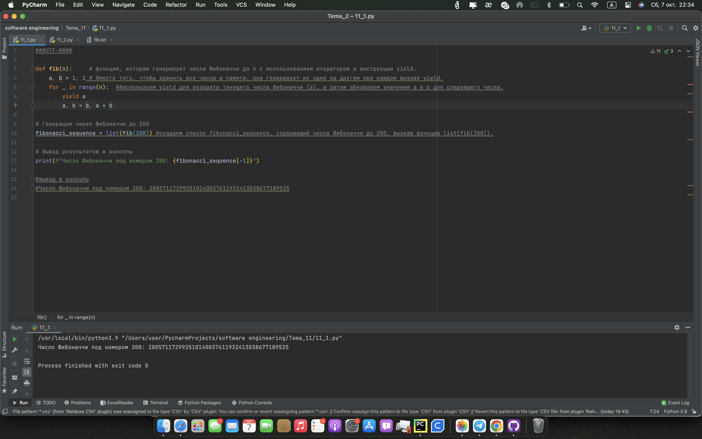
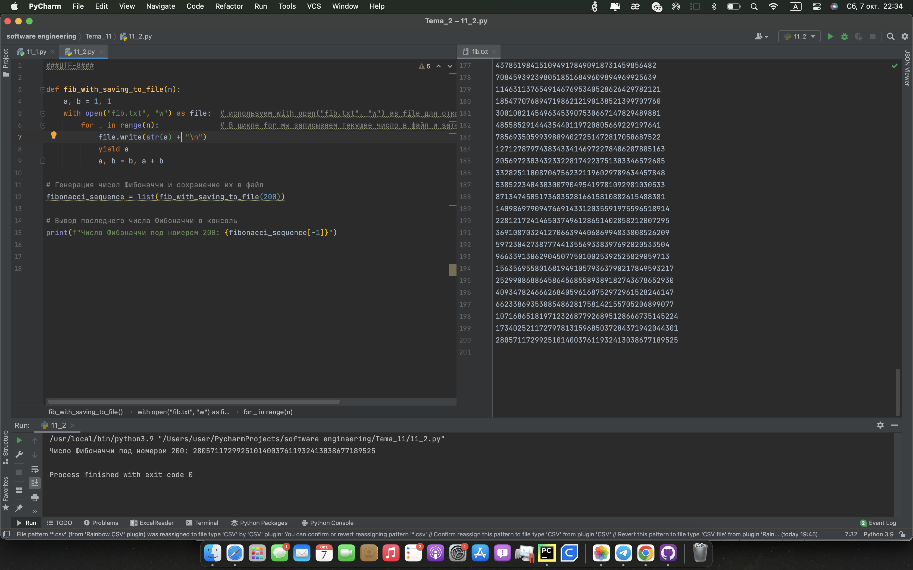

# Тема 11 Итераторы и генераторы
Отчет по Теме #11 выполнил(а):
- Кондратьева Анастасия Григорьевна
- ЗПИЭ-20-2

 Задание | Сам_раб |
| ------ | ------ |
| Задание 1 | + |
| Задание 2 | + |

знак "+" - задание выполнено; знак "-" - задание не выполнено;

Работу проверили:
- к.э.н., доцент Панов М.А.

## Лабораторная работа №1
### Вас никак не могут оставить числа Фибоначчи, очень уж они вас заинтересовали. Изучив новые возможности Python вы решили реализовать программу, которая считает числа Фибоначчи при помощи итераторов. Расчет начинается с чисел 1 и 1. Создайте функцию fib(n), генерирующую n чисел Фибоначчи с минимальными затратами ресурсов. Для реализации этой функции потребуется обратиться к инструкции yield (Она не сохраняет в оперативной памяти огромную последовательность, а дает возможность “доставать” промежуточные результаты по одному). Результатом решения задачи будет листинг кода и вывод в консоль с числом Фибоначчи от 200.
```python
def fib(n):     # функция, которая генерирует числа Фибоначчи до n с использованием итераторов и инструкции yield.
    a, b = 1, 1 # Вместо того, чтобы хранить все числа в памяти, она генерирует их одно за другим при каждом вызове yield.
    for _ in range(n):  ##используем yield для возврата текущего числа Фибоначчи (a), а затем обновляем значения a и b для следующего числа.
        yield a
        a, b = b, a + b

# Генерация чисел Фибоначчи до 200
fibonacci_sequence = list(fib(200)) #создаем список fibonacci_sequence, содержащий числа Фибоначчи до 200, вызвав функцию list(fib(200)).

# Вывод результатов в консоль
print(f"Число Фибоначчи под номером 200: {fibonacci_sequence[-1]}")

#вывод в консоль
#Число Фибоначчи под номером 200: 280571172992510140037611932413038677189525
```
### Результат.

## Выводы
Узнали про yield
      

## Лабораторная работа №2
### К коду предыдущей задачи добавьте запоминание каждого числа Фибоначчи в файл “fib.txt”, при этом каждое число должно находиться на отдельной строчке. Результатом выполнения задачи будет листинг кода и скриншот получившегося файла.
```python
def fib_with_saving_to_file(n):
    a, b = 1, 1
    with open("fib.txt", "w") as file:  # используем with open("fib.txt", "w") as file для открытия файла в режиме записи.
        for _ in range(n):              # В цикле for мы записываем текущее число в файл и затем возвращаем его с помощью yield.
            file.write(str(a) + "\n")
            yield a
            a, b = b, a + b

# Генерация чисел Фибоначчи и сохранение их в файл
fibonacci_sequence = list(fib_with_saving_to_file(200))

# Вывод последнего числа Фибоначчи в консоль
print(f"Число Фибоначчи под номером 200: {fibonacci_sequence[-1]}")
```
### Результат.

## Выводы
Записали в файл числа, каждое на новой строке
      


## Общие выводы по теме
работали с числами фиббоначи