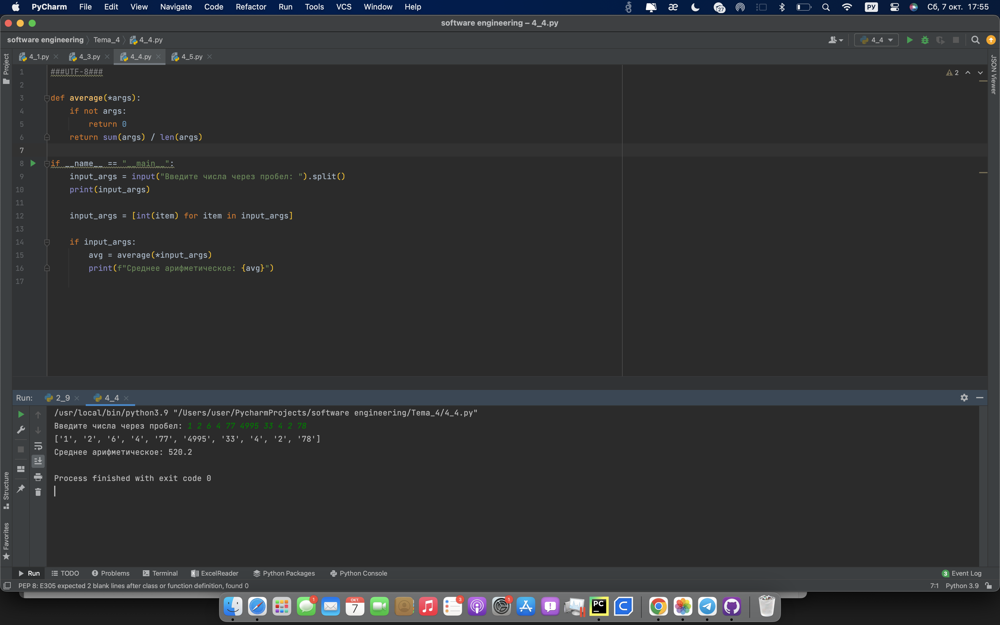

# Тема 4 Функции и стандартные модули/библиотеки
Отчет по Теме #4 выполнил(а):
- Кондратьева Анастасия Григорьевна
- ЗПИЭ-20-2

 Задание | Сам_раб |
| ------ | ------ |
| Задание 1 | + |
| Задание 2 | + |
| Задание 3 | + |
| Задание 4 | + |
| Задание 5 | + |

знак "+" - задание выполнено; знак "-" - задание не выполнено;

Работу проверили:
- к.э.н., доцент Панов М.А.

## Лабораторная работа №1
### Написать комментарии к коду.
```python
#импортирует модуль datetime из библиотеки datetime
from datetime import datetime
#Импортирует модуль sqrt из библиотеки match
from math import sqrt

# Объявление функции main с использованием **kwargs, что позволяет передавать произвольное количество именованных аргументов
def main(**kwargs):
    '''
      Основная функция программы

        Параметры:
          kwargs : произвольное количество аргументов

        Возвращаемое значение
          result (num): Квадратный корень из суммы квадратов двух чисел
      '''
    for key in kwargs.items():
        # Расчет значения result как корня из суммы квадратов двух элементов списка, связанного с ключом
        result = sqrt(key[1][0] ** 2 + key[1][1] ** 2)
        # Вывод результата на экран
        print(result)

#конструкция if __name__ == "__main__": позволяет определить, как именно был запущен скрипт — непосредственно или через импорт в другой скрипт.
if __name__ == "__main__":
    # Засекаем начальное время выполнения программы
    start_time = datetime.now()
    # Вызываем функцию main с передачей именованных аргументов
    main(
        one=[10, 3],
        two=[5, 4],
        three=[15, 13],
        four=[93, 53],
        five=[133, 15]
    )
    # Рассчитываем время выполнения программы как разницу между текущим временем и начальным временем
    time_costs = datetime.now() - start_time
    # Выводим время выполнения программы
    print(f"Время выполнения программы - {time_costs}")#импортирует модуль datetime из библиотеки datetime
from datetime import datetime
#Импортирует модуль sqrt из библиотеки match
from math import sqrt

# Объявление функции main с использованием **kwargs, что позволяет передавать произвольное количество именованных аргументов
def main(**kwargs):
    '''
      Основная функция программы

        Параметры:
          kwargs : произвольное количество аргументов

        Возвращаемое значение
          result (num): Квадратный корень из суммы квадратов двух чисел
      '''
    for key in kwargs.items():
        # Расчет значения result как корня из суммы квадратов двух элементов списка, связанного с ключом
        result = sqrt(key[1][0] ** 2 + key[1][1] ** 2)
        # Вывод результата на экран
        print(result)

#конструкция if __name__ == "__main__": позволяет определить, как именно был запущен скрипт — непосредственно или через импорт в другой скрипт.
if __name__ == "__main__":
    # Засекаем начальное время выполнения программы
    start_time = datetime.now()
    # Вызываем функцию main с передачей именованных аргументов
    main(
        one=[10, 3],
        two=[5, 4],
        three=[15, 13],
        four=[93, 53],
        five=[133, 15]
    )
    # Рассчитываем время выполнения программы как разницу между текущим временем и начальным временем
    time_costs = datetime.now() - start_time
    # Выводим время выполнения программы
    print(f"Время выполнения программы - {time_costs}")
```
### Результат.

## Выводы
Научились PyDoc
      

## Лабораторная работа №2
### Напишите программу, которая будет заменять игральную кость с 6 гранями. Если значение равно 5 или 6, то в консоль выводится «Вы победили», если значения 3 или 4, то вы рекурсивно должны вызвать эту же функцию, если значение 1 или 2, то в консоль выводится "Вы проиграли". При этом каждый вызов функции необходимо выводить в консоль значение "кубика". Для выполнения задания необходимо использовать стандартную библиотеку random. Программу нужно написать, используя одну функцию и "очку входа"
```python
import random

def roll_dice():
    # Бросаем игральную кость
    dice_value = random.randint(1, 6)
    print(f"Вы бросили кубик и выпало: {dice_value}")

    if dice_value in [5, 6]:
        print("Вы победили")
        return
    elif dice_value in [3, 4]:
        print("Вы продолжаете игру...")
        roll_dice()  # Рекурсивный вызов функции для броска кубика
    else:
        print("Вы проиграли")
        return
if __name__ == "__main__":
    roll_dice()  # Точка входа в программу
```
### Результат.

## Выводы
научились импортировать рандом
      

## Лабораторная работа №3
### Напишите программу, которая будет выводить текущее время, с точностью до секунд на протяжении 5 секунд. Программу нужно написать с использованием цикла. Подсказка: необходимо использовать модуль datetime и time, а также вам необходимо как-то "усыплять" программу на 1 секунду.
```python
import datetime
import time

# Запускаем цикл на 5 секунд
for _ in range(5):
    # Получаем текущее время
    current_time = datetime.datetime.now().strftime('%H:%M:%S')

    # Выводим текущее время
    print(current_time)

    # Засыпаем на 1 секунду
    time.sleep(1)
```
### Результат.

## Выводы
научились усыплять программу и выводить разные данные в одну строку
      

## Лабораторная работа №4
### Напишите программу, которая считает среднее арифметическое от аргументов вызываемое функции, с условием того, что изначальное количество этих аргументов неизвестно. Программу необходимо реализовать используя одну функцию и "точку входа"
```python
def average(*args):
    if not args:
        return 0
    return sum(args) / len(args)

if __name__ == "__main__":
    input_args = input("Введите числа через пробел: ").split()
    print(input_args)

    input_args = [int(item) for item in input_args]

    if input_args:
        avg = average(*input_args)
        print(f"Среднее арифметическое: {avg}")
```
### Результат.

## Выводы
Научились обрабатывать аргументы
      

## Лабораторная работа №5
### Создайте два Python файла, в одном будет выполняться вычисление площади треугольника при помощи формулы Герона (необходимо реализовать через функцию), а во втором будет происходить взаимодействие с пользователем (получение всей необходимой информации и вывод результатов). Напишите эту программу и выведите в консоль полученную площадь.
```python
from Tema_4 import calculate_triangle_area as calc


def get_user_input():
    # Запрашиваем длины сторон у пользователя
    a = float(input("Введите длину стороны a: "))
    b = float(input("Введите длину стороны b: "))
    c = float(input("Введите длину стороны c: "))
    return a, b, c

def main():
    print("Программа для вычисления площади треугольника по формуле Герона.")

    a, b, c = get_user_input()

    # Проверка на корректность длин сторон для построения треугольника
    if a + b > c and a + c > b and b + c > a:
        area = calc.calculate_triangle_area(a, b, c)
        print(f"Площадь треугольника: {area:.2f}")
    else:
        print("Треугольник с такими сторонами нельзя построить.")


if __name__ == "__main__":
    main()
```
### Результат.

## Выводы
Научились импортировать функции
      


## Общие выводы по теме
Освоили работу с импортом библиотек
      