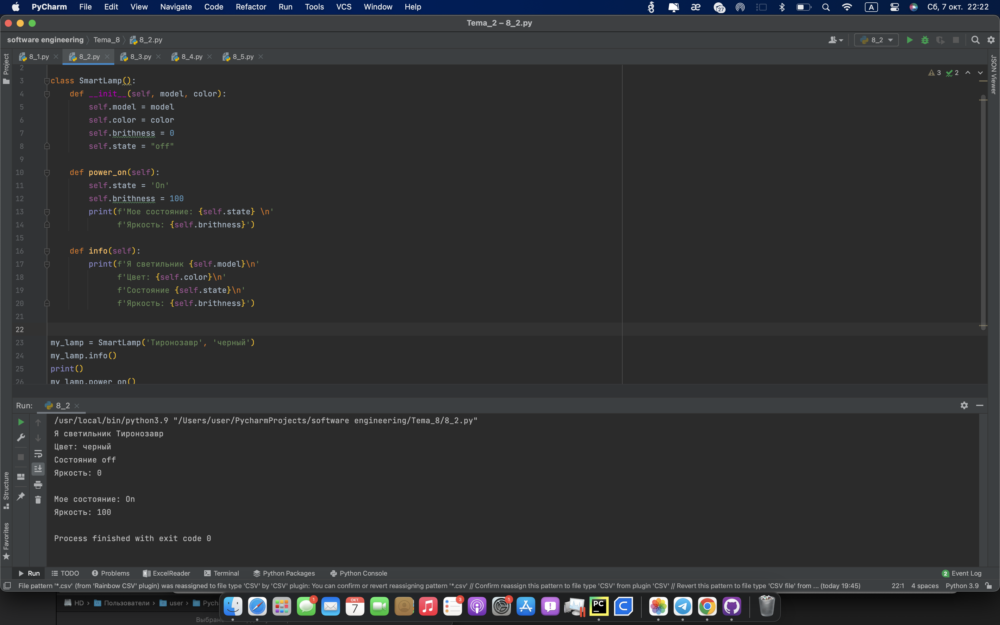
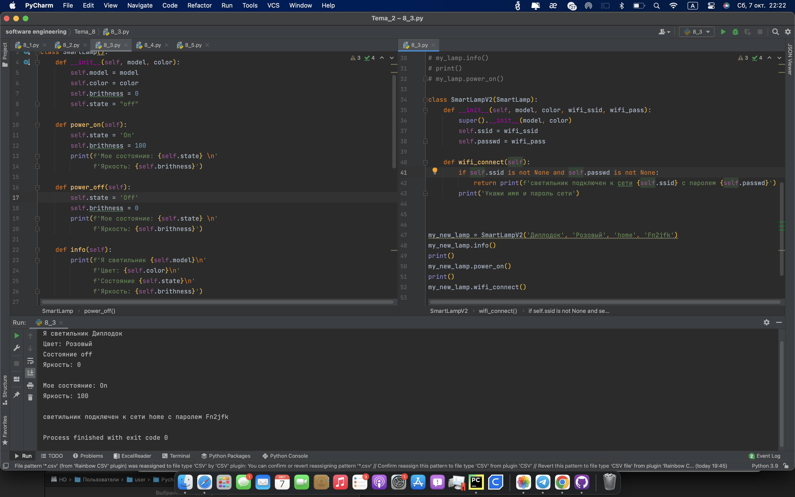

# Тема 8 Введение в ООП
Отчет по Теме #8 выполнил(а):
- Кондратьева Анастасия Григорьевна
- ЗПИЭ-20-2

 Задание | Сам_раб |
| ------ | ------ |
| Задание 1 | + |
| Задание 2 | + |
| Задание 3 | + |
| Задание 4 | + |
| Задание 5 | + |

знак "+" - задание выполнено; знак "-" - задание не выполнено;

Работу проверили:
- к.э.н., доцент Панов М.А.

## Лабораторная работа №1
### Самостоятельно создайте класс и его объект. Они должны отличаться, от тех, что указаны в теоретическом материале (методичке) и лабораторных заданиях. Результатом выполнения задания будет листинг кода и получившийся вывод консоли.
```python
class SmartLamp():
    def __init__(self, model, color):
        self.model = model
        self.color = color

my_lamp = SmartLamp('Тиронозавр', 'черный')
```
### Результат.

## Выводы
Создали класс.
      

## Лабораторная работа №2
### Cамостоятельно создайте атрибуты и методы для ранее созданного класса. Они должны отличаться, от тех, что указаны в теоретическом материале (методичке) и лабораторных заданиях. Результатом выполнения задания будет листинг кода и получившийся вывод консоли.
```python
class SmartLamp():
    def __init__(self, model, color):
        self.model = model
        self.color = color
        self.brithness = 0
        self.state = "off"

    def power_on(self):
        self.state = 'On'
        self.brithness = 100
        print(f'Мое состояние: {self.state} \n'
              f'Яркость: {self.brithness}')

    def info(self):
        print(f'Я светильник {self.model}\n'
              f'Цвет: {self.color}\n'
              f'Состояние {self.state}\n'
              f'Яркость: {self.brithness}')


my_lamp = SmartLamp('Тиронозавр', 'черный')
my_lamp.info()
print()
my_lamp.power_on()
```
### Результат.

## Выводы
Создали функции класса
      

## Лабораторная работа №3
### Самостоятельно реализуйте наследование, продолжая работать с ранее созданным классом. Оно должно отличаться, от того, что указано в теоретическом материале (методичке) и лабораторных заданиях. Результатом выполнения задания будет листинг кода и получившийся вывод консоли.
```python
class SmartLamp():
    def __init__(self, model, color):
        self.model = model
        self.color = color
        self.brithness = 0
        self.state = "off"

    def power_on(self):
        self.state = 'On'
        self.brithness = 100
        print(f'Мое состояние: {self.state} \n'
              f'Яркость: {self.brithness}')

    def power_off(self):
        self.state = 'Off'
        self.brithness = 0
        print(f'Мое состояние: {self.state} \n'
              f'Яркость: {self.brithness}')

    def info(self):
        print(f'Я светильник {self.model}\n'
              f'Цвет: {self.color}\n'
              f'Состояние {self.state}\n'
              f'Яркость: {self.brithness}')


# my_lamp = SmartLamp('Тиронозавр', 'черный')
# my_lamp.info()
# print()
# my_lamp.power_on()

class SmartLampV2(SmartLamp):
    def __init__(self, model, color, wifi_ssid, wifi_pass):
        super().__init__(model, color)
        self.ssid = wifi_ssid
        self.passwd = wifi_pass

    def wifi_connect(self):
        if self.ssid is not None and self.passwd is not None:
            return print(f'светильник подключен к cети {self.ssid} c паролем {self.passwd}')
        print('Укажи имя и пароль сети')


my_new_lamp = SmartLampV2('Диплодок', 'Розовый', 'home', 'Fn2jfk')
my_new_lamp.info()
print()
my_new_lamp.power_on()
print()
my_new_lamp.wifi_connect()
```
### Результат.

## Выводы
Изуччили наследования классов
      

## Лабораторная работа №4
### Самостоятельно реализуйте инкапсуляцию, продолжая работать с ранее созданным классом. Она должна отличаться, от того, что указана в теоретическом материале (методичке) и лабораторных заданиях. Результатом выполнения задания будет листинг кода и получившийся вывод консоли.
```python
class SmartLamp():
    def __init__(self, model, color):
        self.model = model
        self.color = color
        self._brithness = 0
        self.__state = "off"

    def power_on(self):
        self.__state = 'On'
        self._brithness = 100
        print(f'Мое состояние: {self.__state} \n'
              f'Яркость: {self._brithness}')

    def info(self):
        print(f'Я светильник {self.model}\n'
              f'Цвет: {self.color}\n'
              f'Состояние {self.__state}\n'
              f'Яркость: {self._brithness}')


my_lamp = SmartLamp('Тиронозавр', 'черный')
print(my_lamp._brithness) #вывод защищенного атрибута
# print(my_lamp.__state) #ошибка доступа к приватному атрибуту
print(my_lamp._brithness == 70) #ошибка доступа к внешнему изменению защищенного атрибута
my_lamp.power_on() #корректный доступ к изменению защищеного и приватного атрибута функией класса
```
### Результат.

## Выводы
Научились инкапсулировать свойства
      

## Лабораторная работа №5
### Самостоятельно реализуйте полиморфизм. Он должен отличаться, от того, что указан в теоретическом материале (методичке) и лабораторных заданиях. Результатом выполнения задания будет листинг кода и получившийся вывод консоли.
```python
class Animal:
    def __init__(self, name):
        self.name = name

    def speak(self):
        pass

class Dog(Animal):
    def speak(self):
        return "Гав-гав!"

class Cat(Animal):
    def speak(self):
        return "Мур-мур"

animals = [Dog("Бобик"), Cat("Мурка"), Dog("Жуля")]

for animal in animals:
    print(f'{animal.name}: {animal.speak()}')
```
### Результат.

## Выводы
Научились полиморфизму в его базовом виде
      


## Общие выводы по теме
Изуччили классы, ооп
      